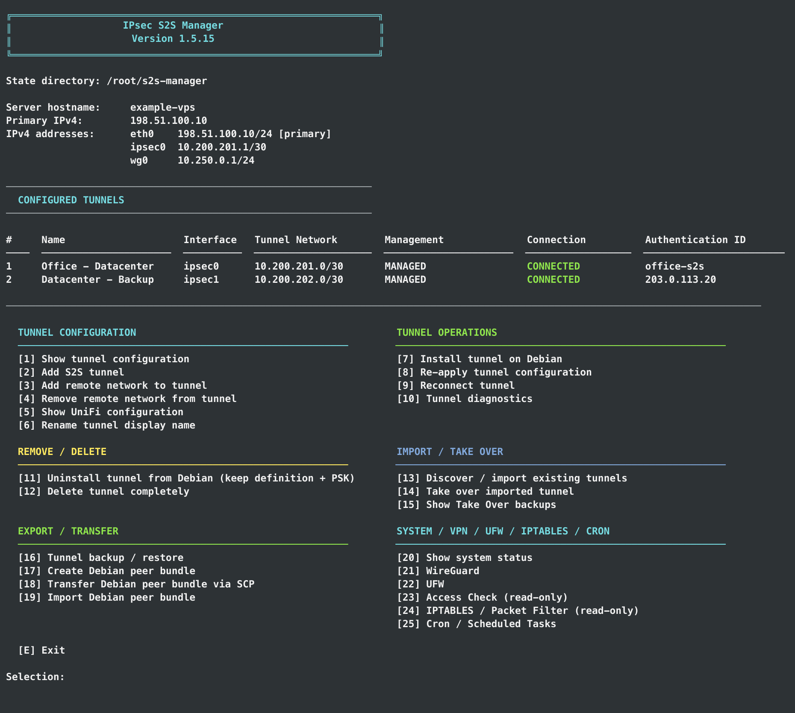

# IPsec S2S Manager

[English](README.md) | **Deutsch**

Interaktive Bash-Verwaltung für routenbasierte IKEv2/IPsec-Tunnel, WireGuard-Fernzugriff, UFW, Paketpfad-Diagnosen, Cronjobs und Samba-Freigaben unter Debian 13. Der Manager lässt sich auch ohne IPsec nutzen: Das vollständige Hauptmenü öffnet sich sofort und funktionsbezogene Komponenten werden erst bei Bedarf angeboten.

Das Projekt richtet sich an Administratoren, die geführte und nachvollziehbare Änderungen wünschen, ohne dass die zugrunde liegende Linux-Konfiguration verborgen wird. Vorhandene Installationen können zunächst schreibgeschützt erkannt und geprüft werden.

> Alle Adressen und Namen in dieser Dokumentation sind fiktive Beispiele. Die echte Oberfläche verwendet Terminalfarben.



## Inhalt

- [Warum S2S Manager?](#warum-s2s-manager)
- [Verwaltete Bereiche](#verwaltete-bereiche)
- [Wichtige Funktionen](#wichtige-funktionen)
- [Sicherheitsmodell](#sicherheitsmodell)
- [Voraussetzungen](#voraussetzungen)
- [Start und Aktualisierung](#start-und-aktualisierung)
- [Schnellstart](#schnellstart)
- [Zustand, Konfiguration und Backups](#zustand-konfiguration-und-backups)
- [Wichtige Einschränkungen](#wichtige-einschränkungen)
- [Dokumentation](#dokumentation)

## Warum S2S Manager?

S2S Manager entstand aus meiner persönlichen Sammlung von Notizen und Copy-and-paste-Konfigurationsblöcken. Ich wollte mehrere Site-to-Site-Standorte verbinden und brauchte eine wiederholbare Checkliste, die keine Adresse, Route, Firewallregel oder strongSwan-Einstellung vergisst. Die ursprüngliche Motivation war konstruktive Faulheit: die sorgfältige Arbeit einmal erledigen, statt dieselben fehleranfälligen Schritte auf jedem Server zu wiederholen.

Mit weiteren Tunneln und VPS-Systemen wurde aus der Dokumentation schrittweise ein interaktives Skript. Praktische Anforderungen führten anschließend zu Debian-Peer-Bundles, Wiederverbindungslogik, WireGuard, UFW, Zugriffstests, Paketfilter-Diagnosen, Serverinformationen und Cron-Verwaltung.

Ich habe das Projekt iterativ zusammen mit OpenAIs ChatGPT und Codex entworfen und entwickelt. Ich lege Anforderungen und Verhalten fest und teste auf den Zielsystemen; die KI unterstützt bei Analyse, Umsetzung, automatisierten Tests und Dokumentation. Diese Zusammenarbeit gehört offen zur Entstehungsgeschichte und ersetzt keine Prüfung oder Tests auf realen Netzwerk- und Firewall-Systemen.

## Verwaltete Bereiche

| Bereich | Hauptmenü | Funktionen |
|---|---:|---|
| IPsec Site-to-Site | 1–19 | Lebenszyklus für UniFi ↔ Debian und Debian ↔ Debian |
| Serverstatus | 20 | Host, Virtualisierung, CPU, RAM, Speicher und Laufzeit |
| WireGuard | 21 | IPv4-Full-Tunnel-Server und Clients |
| UFW | 22 | Sichere Installation, Aktivierung und Eingangsregeln |
| Access Check | 23 | Schreibgeschützte Analyse von Routen, Firewall, NAT und Diensten |
| IPTABLES | 24 | Schreibgeschützte Filter-, NAT-, Docker- und Paketpfad-Diagnose |
| Cron | 25 | Übersicht und Verwaltung geplanter Aufgaben |
| Samba | 26 | Erkennung/Übernahme vorhandener Shares, Gruppenbereiche, Benutzer und Diagnose |

## Wichtige Funktionen

### IPsec Site-to-Site

- Routenbasiertes IKEv2/IPsec mit strongSwan, `swanctl`, Linux-VTI und eigenem `/30`-Transfernetz
- Explizite VPN-Routen in Tabelle 220 ohne pauschale Default-Route
- UniFi- und Debian-Peers mit statischer IPv4, DDNS oder dynamischem UniFi-Endpunkt
- Prüfung auf Adressüberschneidungen, Endpunkt-, Routing- und Authentifizierungsfehler
- Installation, Deinstallation, Re-apply, Wiederverbindung und ausführliche Diagnose
- Schreibgeschützter Import vor kontrollierter Übernahme
- Backups unter `/root/s2s-manager/backups/` und Exporte unter `/root/s2s-manager/exports/`

### WireGuard

- Neuer IPv4-Full-Tunnel-Server oder schreibgeschützter Import vorhandener Konfigurationen
- Bewusste Übernahme mit Backup und automatischem Rollback bei fehlgeschlagenem Start
- Clients hinzufügen, umbenennen, exportieren, als QR-Code anzeigen und entfernen
- Änderung des verwalteten `/24`-Netzes unter Beibehaltung von Schlüsseln und Hostnummern
- NAT, IPv4-Forwarding, Tabelle 220, Handshakes und Datenzähler

### UFW und Paketpfade

- UFW erkennen, installieren, sicher aktivieren, deaktivieren und neu laden
- SSH-Regel vor der Aktivierung vorbereiten und prüfen
- Permanente sowie zeitlich begrenzte TCP/UDP-Regeln mit Vorschau
- INPUT, FORWARD, DNAT, MASQUERADE, Docker-Ketten und relevante Routen untersuchen
- Die IPTABLES-Sektion verändert oder löscht keine Paketfilterregeln

### Cron

- Benutzer-Crontabs, `/etc/crontab`, `/etc/cron.d/*` und periodische Verzeichnisse erfassen
- Verwaltete (`S2S`) und externe Einträge unterscheiden
- Verständliche Zeitplanbeschreibung und geführte Eingabe
- Jobs übernehmen, bearbeiten, aktivieren/deaktivieren, sofort ausführen und löschen
- Vollständige Quell-Backups unter `/root/s2s-manager/cron/backups/`
- Schutz vor dem Überschreiben zwischenzeitlicher externer Änderungen

### Samba

- Optionale Installation; das Öffnen installiert nichts
- Effektive Freigaben als `SYSTEM`, `EXTERNAL` oder `S2S` anzeigen
- `[homes]`, `[printers]`, `[print$]` und `IPC$` als Systemfunktionen behandeln
- Eindeutig gefundene externe Shares mit ihren wirksamen `testparm`-Werten übernehmen
- Gemeinsame Gruppenbereiche in `/etc/samba/s2s-manager-shares.conf`
- Exakte Vorschau der aktuellen und neuen Konfiguration vor der Umwandlung eines Manager-Shares in das Standardprofil
- Geführte Auswahl der in Shares verwendeten Gruppen einschließlich Mitgliederzahl
- Normale Linux-/Samba-Benutzer und Samba-only-Konten mit `nologin`; sichere Namen mit Groß- und Kleinbuchstaben werden unterstützt
- Benutzerübersicht unterscheidet vorhandene, fehlende und absichtlich nicht angelegte Home-Verzeichnisse
- Schreibgeschützte Live-Sitzungen/offene Dateien über `smbstatus` sowie eine Share-/Gruppen-/Kontenmatrix
- Geführte SMB-Firewallregel mit vorbelegtem TCP-Port 445 und auswählbaren entfernten S2S-Netzen, einzelnen Debian-S2S-Peers und WireGuard-Quellen; öffentlicher Zugriff über `any` wird nicht angeboten
- Backups unter `/root/s2s-manager/samba/backups/`, Prüfung vor Reload und automatischer Rollback

## Sicherheitsmodell

Der Manager läuft als root, weil er Systemnetzwerk und Dienste konfigurieren kann. Deshalb gilt:

- Status- und Übersichtsseiten schreiben keine Konfiguration um.
- Kritische Änderungen zeigen eine Vorschau und verlangen eine Bestätigung.
- Vorhandene IPsec-, WireGuard- und Cron-Konfigurationen werden zuerst schreibgeschützt importiert.
- Übernahmen und Änderungen erzeugen Backups; deren Pfad wird angezeigt.
- Samba-Änderungen sichern die betroffenen Konfigurationsdateien vor dem Schreiben.
- UFW wird ohne passende SSH-Sicherheitsregel nicht aktiviert.
- Access Check und IPTABLES sind schreibgeschützt.
- Geheimnisse besitzen restriktive Dateirechte und werden in normalen Statusansichten nicht ausgegeben.

Halte bei Änderungen an Remote-Netzwerk oder Firewall immer eine unabhängige Provider-Konsole bereit.

## Voraussetzungen

- Debian 13 und root-Rechte
- Bash und übliche Debian-Systemwerkzeuge
- Paket-/Internetzugriff, wenn optionale Abhängigkeiten installiert werden sollen
- Passende öffentliche oder geroutete/NAT-Umgebung für verwendete VPN-Funktionen
- Erreichbare UDP-Ports 500/4500 für IPsec beziehungsweise der gewählte WireGuard-Port
- SSH nur für die direkte Übertragung von Debian-Peer-Bundles

strongSwan/IPsec, UFW, WireGuard, QR-Erzeugung, Cron und Samba sind bis zur Nutzung der jeweiligen Funktion optional. Beim Start wird nichts davon automatisch installiert. Provider-Firewalls bleiben außerhalb des Managers.

## Start und Aktualisierung

Als root die aktuelle GitHub-Version direkt ausführen:

```bash
bash <(curl -fsSL "https://raw.githubusercontent.com/Nisbo/s2s-manager/main/s2s-manager.sh?nocache=$(date +%s)")
```

Dabei wird das Skript nicht lokal gespeichert. Für eine lokale Kopie:

```bash
curl -fsSL "https://raw.githubusercontent.com/Nisbo/s2s-manager/main/s2s-manager.sh?nocache=$(date +%s)" -o s2s-manager.sh
chmod +x s2s-manager.sh
./s2s-manager.sh
```

Zur Aktualisierung einer lokalen Kopie dieselben drei Befehle erneut im betreffenden Verzeichnis ausführen. Gespeicherter Zustand und installierte Systemkonfigurationen bleiben erhalten. Prüfe danach die Versionsnummer im Banner.

## Schnellstart

Das Hauptmenü ist sofort verfügbar. Wer nur Cron, IPTABLES, UFW, WireGuard, Samba oder Systeminformationen benötigt, wählt den Bereich direkt; strongSwan ist dafür nicht erforderlich.

### UniFi ↔ Debian

1. **[2] Add S2S tunnel** öffnen und **UniFi Gateway** wählen.
2. Endpunkte, eindeutiges `/30`-Transfernetz und entfernte LANs eingeben.
3. Vorschau prüfen und Debian-Seite installieren.
4. Werte aus **[5] Show UniFi configuration** in UniFi übernehmen.
5. Verbindung mit **[10] Tunnel diagnostics** prüfen.

### Debian ↔ Debian

1. Tunnel auf Server A mit **[2]** anlegen und installieren.
2. Gespiegeltes Peer-Bundle mit **[17]** erstellen.
3. Geschützt mit **[18]** oder einem anderen sicheren Kanal übertragen.
4. Auf Server B mit **[19]** importieren und installieren.
5. Beide Seiten mit **[10]** prüfen.

### WireGuard, UFW und Cron

- **[21] WireGuard:** Server anlegen oder vorhandenen Server zunächst importieren; danach Clients und Handshakes verwalten.
- **[22] UFW:** SSH-Sicherheitsregel und alle benötigten Regeln prüfen, bevor die geschützte Aktivierung verwendet wird.
- **[25] Cron:** Gesamtübersicht öffnen, Job anlegen oder übernehmen und Ausführung über Diagnose beziehungsweise Journal bestätigen.

### Samba

1. **[26] Samba / File Shares** öffnen und effektive Freigaben prüfen.
2. `[homes]`, Druckerfreigaben und `IPC$` als Systemobjekte belassen; nur eindeutig gefundene externe statische Shares übernehmen.
3. Gemeinsamen Gruppenbereich erstellen/bearbeiten, die genaue aktuelle/neue Konfiguration prüfen und Linux-/Samba-Benutzer über die geführte Gruppenauswahl zuordnen.
4. Mit Zugriffsmatrix und `smbstatus` wirksame Mitgliedschaften und aktive Clients prüfen.
5. Pfad/Berechtigungen und Diagnose prüfen; TCP 445 nur für vertrauenswürdige LAN-/VPN-/S2S-Quellen freigeben.

Das Entfernen einer Manager-Freigabe behält Verzeichnis und Dateien. Persönliche Home-Share-Regeln, Drucker, Active Directory, Gastfreigaben, SMB1 und rekursive Rechteänderungen gehören bewusst noch nicht zu dieser Version.

## Zustand, Konfiguration und Backups

Zentraler Manager-Zustand: `/root/s2s-manager/`

| Daten | Ort |
|---|---|
| Tunneldefinitionen und Routen | `/root/s2s-manager/tunnels/`, `/root/s2s-manager/routes/` |
| IPsec-Übernahme-Backups | `/root/s2s-manager/backups/` |
| Tunnelbackups und Peer-Bundles | `/root/s2s-manager/exports/` |
| WireGuard-Zustand und Backups | `/root/s2s-manager/wireguard/` |
| WireGuard-Clientexporte | `/root/s2s-manager/wireguard/exports/` |
| Cron-Quellbackups | `/root/s2s-manager/cron/backups/` |
| Samba-Konfigurationsbackups | `/root/s2s-manager/samba/backups/` |

PSKs, private Schlüssel, Clientexporte, QR-Codes und Peer-Bundles sind Geheimnisse. Nicht veröffentlichen oder in öffentliche Tickets kopieren.

## Wichtige Einschränkungen

- Jeder IPsec-Tunnel benötigt ein eigenes, nicht überlappendes `/30`-Transfernetz.
- Überlappende entfernte Routen werden abgelehnt.
- Ein klassisches VTI benötigt einen konkreten Remote-Endpunkt; mehrere IPv4-Ergebnisse eines DDNS-Namens sind nicht zulässig.
- Ein Access Check liefert serverseitige Konfigurationsevidenz, aber keinen echten End-to-End-Test vom Remote-Gerät.
- Komplexe geordnete nftables/iptables-Regeln erlauben nicht immer ein garantiertes Urteil.
- Eine lokale UFW-Regel öffnet keine Provider-Firewall.
- Ein Gast kann KVM/QEMU erkennen, aber meist nicht die dahinterliegende Verwaltungsplattform beweisen.

## Dokumentation

Das [deutsche Wiki-Portal](https://github.com/Nisbo/s2s-manager/wiki/DE---Startseite) enthält die ausführliche deutsche Dokumentation. [MANUAL.md](MANUAL.md) bleibt absichtlich nur ein kurzer Wegweiser, damit alte Links funktionieren und kein zweites veraltendes Handbuch gepflegt wird.

## Lizenz

Für dieses Repository wurde keine Lizenz veröffentlicht. Ohne Lizenz gelten die normalen urheberrechtlichen Einschränkungen.
